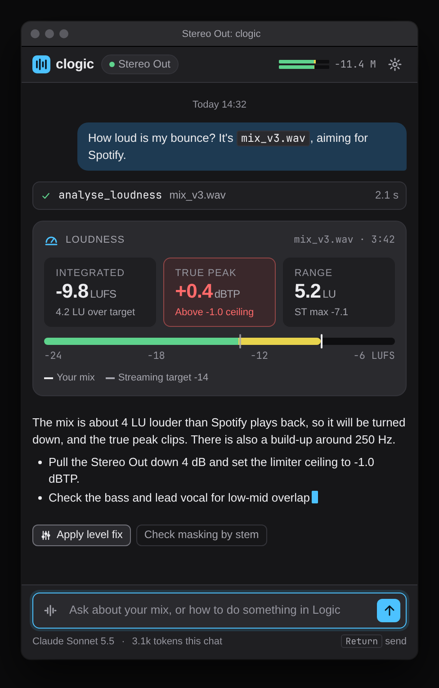

# clogic design

The visual language for the clogic plugin window: a small, dark chat panel that sits next to Logic
Pro's own plugin windows and mixer and looks like it belongs there.

Tokens live in [`tokens.json`](./tokens.json). Static mockups are in [`mockups/`](./mockups). Open
the `.html` files directly in a browser (they load only the local `styles.css`), or look at the
rendered `.png` next to each one.

| Mockup                                                 | Shows                                                        |
| ------------------------------------------------------ | ------------------------------------------------------------ |
| [`onboarding.html`](./mockups/onboarding.html)         | First run: provider picker, API key entry, trust notes       |
| [`chat.html`](./mockups/chat.html)                     | Main chat with a tool call, loudness result card and a reply |
| [`confirm-change.html`](./mockups/confirm-change.html) | Session change confirmation dialog over the chat             |
| [`cards.html`](./mockups/cards.html)                   | Tool call states, tonal balance card, docs citation          |
| [`states.html`](./mockups/states.html)                 | Empty, loading and error states                              |



## Scope and open questions

This is a visual design, not a statement of what Logic allows. The mockups assume:

- The UI is a web view inside the Audio Unit (SPIKE-007), so it can be built with HTML and CSS from
  these tokens. If SPIKE-007 lands on native AppKit or SwiftUI instead, the tokens still apply; the
  CSS does not.
- Session changes (faders, plugin parameters) are reachable through some control surface path
  (SPIKE-004 / SPIKE-005). Which parameters can actually be changed is unknown. The confirmation
  dialog shows the intended shape of the interaction; the example parameters are illustrative.
- Live momentary loudness reaches the UI at about 10 Hz (SPIKE-007 "Done when").
- Logic's plugin window chrome is drawn by Logic. The grey title bar in the mockups is a generic
  placeholder so the panel can be judged in context; it is not a copy of Logic's header and nothing
  in the product draws it.

Provider names are shown as plain text, never as logos, until SPIKE-011 clears trademark use.

## Principles

1. **Sit beside the mixer, do not compete with it.** Neutral dark greys close to Logic's own
   surfaces, one accent colour, no gradients or glow on chrome. Colour is reserved for meaning.
2. **Numbers are the product.** Measurements (LUFS, dBTP, LU, Hz) are large, tabular, and always
   carry their unit. Advice text is secondary to the reading it is based on.
3. **Nothing changes the session without a visible diff.** Every session change goes through a
   confirmation that lists each control, its current value and its new value, with each change
   individually deselectable. Session changes use the caution colour, never the accent.
4. **Show the work.** Every tool call appears in the thread as a compact row with its name, input,
   status and duration, so the user can see what the answer is based on.
5. **Small window first.** Designed at 440 × 680 and must work at 360 × 480. One column, no
   sidebars, no hover-only controls.
6. **Respect focus and keys.** Logic uses most single keys as key commands. The composer shows a
   clear focus ring so it is obvious when typing goes to clogic rather than Logic (see SPIKE-007).

## Colour

Dark is the default and primary theme, because Logic Pro's mixer and plugin windows are dark by
default. Light mirrors every key for users who run Logic in light mode.

### Dark

| Token                  | Hex                               | Use                                       |
| ---------------------- | --------------------------------- | ----------------------------------------- |
| `bg.canvas`            | `#161618`                         | Window background, thread                 |
| `bg.surface`           | `#1F1F22`                         | Header, composer bar, tool rows           |
| `bg.raised`            | `#2A2A2E`                         | Cards, inputs                             |
| `bg.overlay`           | `#33333A`                         | Dialogs, popovers                         |
| `bg.scrim`             | `#0A0A0BB3`                       | Behind modal dialogs                      |
| `bg.userBubble`        | `#1E3A52`                         | User messages                             |
| `border.subtle`        | `#34343A`                         | Dividers, card outlines (decorative)      |
| `border.strong`        | `#73737B`                         | Input and control boundaries              |
| `border.focus`         | `#4CC2FF`                         | Focus ring                                |
| `text.primary`         | `#ECECEF`                         | Body text, values                         |
| `text.secondary`       | `#A6A6AE`                         | Supporting text, units                    |
| `text.tertiary`        | `#95959E`                         | Labels, timestamps, axis ticks            |
| `accent.default`       | `#4CC2FF`                         | Primary action, links, focus, data series |
| `status.success`       | `#5FD38D`                         | Completed tool calls, valid key           |
| `status.caution`       | `#FFB23F`                         | Session changes, flagged bands            |
| `status.danger`        | `#FF6B6B`                         | Errors, over-limit readings               |
| `meter.safe/warn/over` | `#5FD38D` / `#E8D44D` / `#FF5A5A` | Meter zones                               |

### Light

| Token            | Hex       |
| ---------------- | --------- |
| `bg.canvas`      | `#F5F5F7` |
| `bg.surface`     | `#FFFFFF` |
| `bg.raised`      | `#EDEDF0` |
| `bg.overlay`     | `#FFFFFF` |
| `bg.userBubble`  | `#DCEBF7` |
| `border.strong`  | `#85858D` |
| `text.primary`   | `#1C1C1E` |
| `text.secondary` | `#55555C` |
| `text.tertiary`  | `#636369` |
| `accent.default` | `#0A6FB0` |
| `status.success` | `#1A7040` |
| `status.caution` | `#9A5B00` |
| `status.danger`  | `#C62828` |

Full list in `tokens.json`.

### Contrast

WCAG 2.x contrast ratios, computed from `tokens.json`. Text pairs meet AA (4.5:1); `border.*` and
meter pairs meet the 3:1 non-text minimum. `border.subtle` is decorative only and must never be the
sole boundary of an interactive control.

| Foreground       | Background       | Dark  | Light |
| ---------------- | ---------------- | ----- | ----- |
| `text.primary`   | `bg.canvas`      | 15.33 | 15.63 |
| `text.primary`   | `bg.raised`      | 12.12 | 14.56 |
| `text.primary`   | `bg.overlay`     | 10.63 | 17.01 |
| `text.primary`   | `bg.userBubble`  | 9.99  | 13.99 |
| `text.secondary` | `bg.canvas`      | 7.48  | 6.79  |
| `text.secondary` | `bg.raised`      | 5.91  | 6.33  |
| `text.secondary` | `bg.overlay`     | 5.19  | 7.39  |
| `text.tertiary`  | `bg.canvas`      | 6.08  | 5.48  |
| `text.tertiary`  | `bg.surface`     | 5.54  | 5.97  |
| `text.tertiary`  | `bg.raised`      | 4.81  | 5.11  |
| `accent.default` | `bg.canvas`      | 9.01  | 4.93  |
| `accent.default` | `bg.raised`      | 7.13  | 4.59  |
| `text.onAccent`  | `accent.default` | 9.35  | 5.37  |
| `status.caution` | `bg.raised`      | 7.96  | 4.64  |
| `status.caution` | `bg.overlay`     | 6.98  | 5.43  |
| `text.onCaution` | `status.caution` | 10.33 | 5.43  |
| `status.success` | `bg.raised`      | 7.62  | 5.23  |
| `status.danger`  | `bg.raised`      | 5.15  | 4.81  |
| `meter.warn`     | `bg.raised`      | 9.50  | 5.13  |
| `meter.over`     | `bg.raised`      | 4.67  | 4.81  |
| `border.strong`  | `bg.canvas`      | 3.84  | 3.36  |
| `border.strong`  | `bg.raised`      | 3.04  | 3.13  |
| `border.focus`   | `bg.raised`      | 7.13  | 4.59  |

`text.tertiary` is not used on `bg.overlay` (4.22:1); dialogs use `text.secondary`.

Colour is never the only signal: over-limit readings also get an outlined tile and a text reason
("Above -1.0 ceiling"); flagged spectrum bands are named in the reply; tool status has an icon.

## Typography

System fonts, so the panel matches macOS and Logic: SF Pro Text for UI, SF Mono for values,
identifiers and API keys. Fallbacks are listed in `tokens.json`. No bundled font files.

| Token     | Size | Weight | Use                                         |
| --------- | ---- | ------ | ------------------------------------------- |
| `caption` | 11   | 400    | Labels (uppercase, +0.06em), axis ticks     |
| `meta`    | 12   | 400    | Secondary lines, tool rows, hints           |
| `body`    | 13   | 400    | Messages, buttons (500). macOS default size |
| `title`   | 15   | 600    | Brand, dialog titles                        |
| `display` | 20   | 600    | Onboarding heading                          |
| `readout` | 22   | 600    | Measurement values, tabular numerals        |

Line height 1.45 for body, 1.2 for headings and readouts. All numbers use
`font-variant-numeric: tabular-nums` so values do not jitter as meters update.

## Spacing, radius, elevation

4 px base. Scale: `2, 4, 6, 8, 12, 16, 20, 24, 32` (tokens `space.1` to `space.9`). Thread and card
padding is 12; dialog padding is 16; onboarding uses 24 to 32.

| Radius | px  | Use                           |
| ------ | --- | ----------------------------- |
| `xs`   | 3   | Inline code, kbd, bubble tail |
| `sm`   | 6   | Buttons, icon buttons         |
| `md`   | 8   | Inputs, tool rows, readouts   |
| `lg`   | 12  | Cards, bubbles, dialogs       |
| `pill` | 999 | Chips, meter tracks           |

Elevation is mostly done with surface colour, not shadow. Only dialogs and popovers cast a shadow
(`shadow.dialog`, `shadow.popover`), each with a 1 px light hairline so they separate from the dark
canvas.

Minimum hit target is 24 × 24 px; icon buttons are 26 × 26.

## Iconography

- 16 px line icons on a 16 px grid, 1.5 px stroke, round caps and joins, `currentColor`. 12 px in
  dense rows, 20 px in dialog badges.
- The mockups use simple in-house SVG paths. If the product adopts an icon set, it needs a
  permissive licence and the dependency rule in AGENTS.md applies. If the UI goes native, SF Symbols
  is the natural match.
- Core set: settings, send, attach bounce (waveform), check, alert, info, lock, file, meter, paste,
  show, arrow, sliders (session change), book (documentation), retry, chevron.
- Logo mark: four vertical bars of different heights in a rounded square, in `accent.default` with
  `text.onAccent` bars. Reads as a waveform and a level meter.

## Motion

Short and functional. Nothing moves unless it reports state.

| Token     | ms  | Use                                  |
| --------- | --- | ------------------------------------ |
| `instant` | 80  | Hover and press colour changes       |
| `fast`    | 120 | Tool row expand, chip changes        |
| `base`    | 180 | New message enter (fade + 4 px rise) |
| `slow`    | 240 | Dialog and scrim in                  |

Easing: `out` `cubic-bezier(0.2, 0, 0, 1)` for entering, `inOut` for layout. Streaming text shows a
blinking accent caret. Meters update at `meterRefreshHz` (10) with no tweening, so they read like
Logic's own meters. With `prefers-reduced-motion`, drop the rise, spinner rotation and caret blink.

## Layout

- Default window 440 × 680; minimum 360 × 480. Logic sets plugin window size from the plugin's
  requested size; whether it can be resized by the user is a SPIKE-007 question.
- Header 40 px: logo and name, track context chip (which instance this is), live momentary meter,
  settings.
- Thread fills the middle and scrolls; it sticks to the bottom while streaming.
- Composer pinned at the bottom with the provider, model and token count underneath (SPIKE-009 cost
  visibility).
- Bubbles max 88 % wide. Assistant replies are unboxed full-width text; cards and tool rows go
  full width.

## Components

### Chat messages

- **User**: right aligned, `bg.userBubble`, radius `lg` with a `xs` bottom-right corner.
- **Assistant**: no bubble, full width, `text.primary`. Markdown subset: paragraphs, lists, bold,
  inline code. Streaming caret while the reply arrives.
- **Day separator**: centred `caption` in `text.tertiary`.

### Tool call row

One line, `bg.surface`, radius `md`. Status icon (spinner, `success` check, `danger` alert), tool
name in mono, the main input, duration right aligned. Click to expand the raw arguments and result.
Failed rows get a danger-tinted border and the error as the input text. See `cards.html`.

### Analysis result cards

Card: `bg.raised`, radius `lg`, 12 px padding. Header row: icon in accent, uppercase label, source
file and duration right aligned in mono.

- **Loudness**: three readout tiles (Integrated LUFS, True peak dBTP, Loudness range LU), each with
  a one-line comparison to the target. A horizontal scale from -24 to -6 LUFS with meter zones,
  a marker for the mix and a grey marker for the target. Tiles over a limit switch to the danger
  treatment.
- **Tonal balance / spectrum**: octave-band bars in accent with a dashed reference curve in
  `meter.reference`. Bands the assistant flags switch to caution. Frequency labels in mono.
- **Docs citation**: a tool row styled link with the book icon and the guide page title, opening
  Apple's documentation in the browser (SPIKE-002).

Suggested follow-ups sit under the reply as small buttons. Any follow-up that would change the
session carries the sliders icon and always opens the confirmation dialog.

### Session change confirmation

Modal over a scrim. Caution badge, title stating the count ("Apply 2 changes to your session?"),
and the reason it was suggested. A list of changes, each with a checkbox, control name, location
(track · plugin) and a mono `old → new` diff with the new value in caution. Unchecked rows strike
through the new value and update the title count. A note says how the change is sent and that the
project file and audio are never edited (AGENTS.md rule 8). Buttons: ghost **Cancel** (Esc) and
caution **Apply N changes**. No default action on Return, so a stray key press in Logic cannot
confirm.

After applying, the thread shows a summary row with a **Revert** action that restores the recorded
previous values (subject to what SPIKE-004 / 005 find is readable).

### API key entry and onboarding

Two steps: provider and key, then an optional short tour. Key field in mono, masked except for the
prefix and last four characters, with show and paste buttons. States: empty, checking (spinner
inline, button disabled), valid (`success` hint with the default model), invalid (`danger` hint with
the provider's reason). A trust panel states where the key is stored (Keychain), where it is never
written (project, bounces, logs) and who bills usage. Primary button **Start chatting** stays
disabled until the key validates.

### Provider picker

Three radio cards (Claude, OpenAI, Grok) with the company name under each. The selected card gets
an accent border and a muted accent fill. In settings the same control appears with a model menu
beneath. Text only, no logos.

### Composer

`bg.raised` box with `border.strong`; on focus `border.focus` plus a 3 px `accent.muted` ring.
Attach-bounce button on the left, send on the right. Return sends, Shift+Return adds a line. Footer
line with provider, model and token count.

### Empty, loading and error states

- **Empty**: logo, "What are we working on?", one line of help, three suggestion buttons
  (loudness, reference comparison, a Logic question).
- **Loading**: running tool row with spinner and elapsed time; for long analyses a card with a
  determinate progress bar and step count, plus skeleton lines where the result will go.
- **Error**: inline banner with danger tint, a plain title, what still works, and actions (Retry,
  Update key). Errors stay in the thread where they happened rather than as toasts.

## Changing the design

Edit `tokens.json` first, then mirror the values in `mockups/styles.css`, re-render the PNGs and
update the tables above. To re-render (headless Chromium, 2× scale):

```sh
cd docs/design/mockups
chromium --headless --hide-scrollbars --force-device-scale-factor=2 \
  --window-size=488,764 --screenshot="$PWD/chat.png" "file://$PWD/chat.html"
```

Window sizes used: 488 × 764 for `onboarding`, `chat` and `confirm-change`; 488 × 510 for `cards`;
1004 × 388 for `states`.
