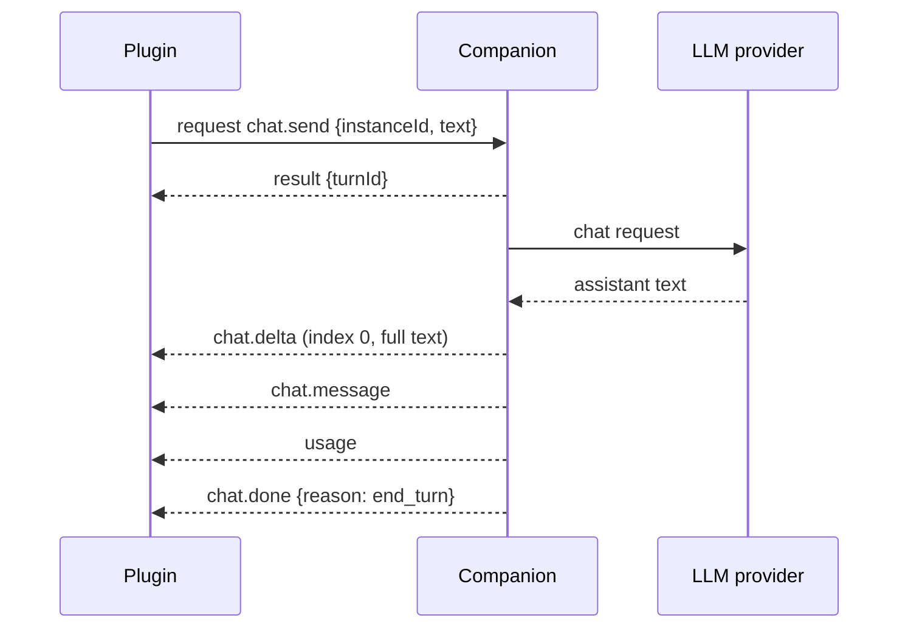
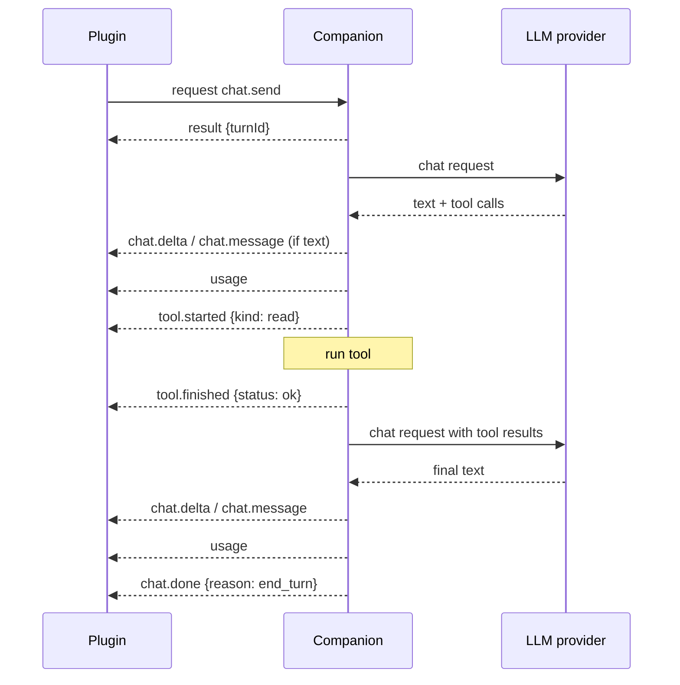
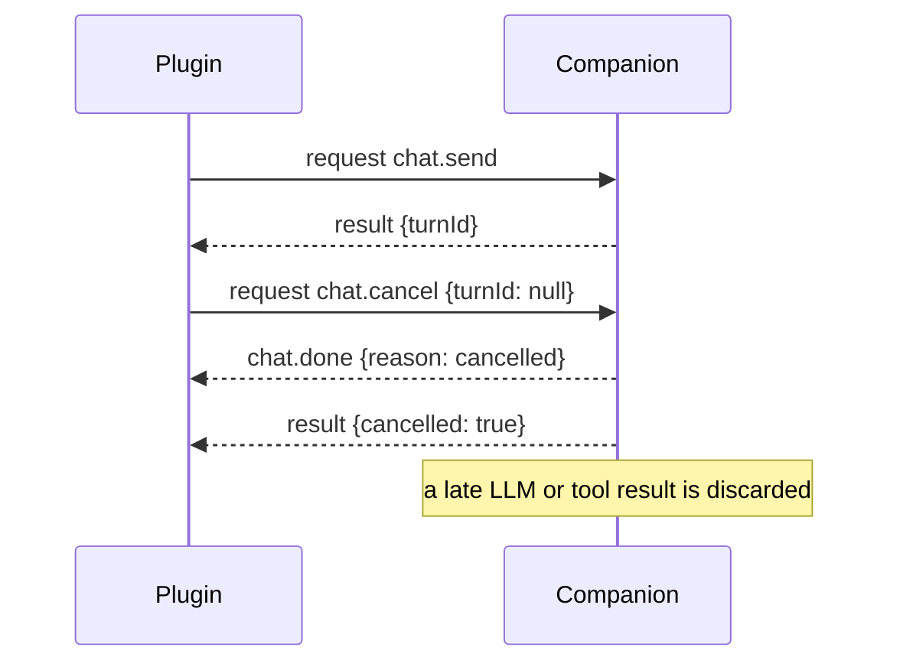
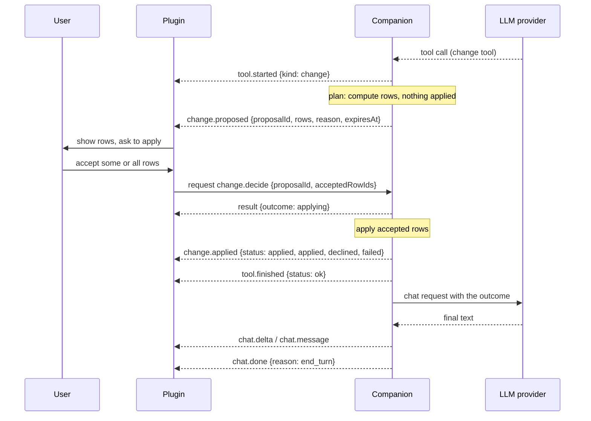

# Plugin ↔ companion protocol

Reference for the newline-delimited JSON-RPC 2.0 protocol between the AUv3 plugin (Swift, to be
written on a Mac) and the Node companion. It is derived from the code in `src/rpc/`
(`messages.ts`, `handshake.ts`, `jsonrpc.ts`, `framer.ts`, `decode.ts`, `codec.ts`, `socket.ts`) and
from how `src/companion/` and `src/agent/` produce and consume those messages. Where the code and
[ADR 0005](./decisions/0005-companion-architecture.md) disagree, the code is described here and the
difference is listed under [Discrepancies](#discrepancies). ADR 0005 is **Proposed**, not accepted.

All example values are placeholders. Protocol version: **1** (`protocolVersion` in
`src/rpc/handshake.ts`).

Nothing here has been run against Logic Pro or a Swift client. The Swift side is unwritten, and
whether an app-group UNIX socket works from the extension is an open Mac check (see
[mac-checklist.md](./research/mac-checklist.md)).

## Contents

1. [Transport and framing](#transport-and-framing)
2. [Message envelope](#message-envelope)
3. [Handshake and versioning](#handshake-and-versioning)
4. [Requests (plugin → companion)](#requests-plugin--companion)
5. [Notifications, plugin → companion](#notifications-plugin--companion)
6. [Notifications, companion → plugin](#notifications-companion--plugin)
7. [Error codes](#error-codes)
8. [Turn lifecycle](#turn-lifecycle)
9. [Change proposals and approval](#change-proposals-and-approval)
10. [Swift Codable checklist](#swift-codable-checklist)
11. [Discrepancies](#discrepancies)

## Transport and framing

- **Transport:** a stream UNIX domain socket. The companion binary takes the socket path as its first
  argument or from `CLOGIC_SOCKET` (`src/companion/main.ts`). The path is chosen by whoever launches
  it; the ADR proposes the app group container (see [Discrepancies](#discrepancies)). On start, the
  companion removes a stale socket file at that path (a socket nobody is listening on) and otherwise
  fails with `EADDRINUSE`.
- **Direction:** the plugin connects; the companion listens. One connection serves one plugin
  instance (see [Instances](#instances)). Only the plugin sends requests; the companion never sends
  requests.
- **Framing:** one JSON value per line, terminated by LF (`0x0A`).
  - A single trailing CR (`0x0D`) before the LF is stripped, so CRLF is accepted on input.
  - Lines that are empty or whitespace only are ignored without a reply.
  - Lines are decoded as UTF-8 in strict mode. Invalid UTF-8 produces a parse error reply
    (`-32700`, `Parse error: invalid UTF-8`) and the line is dropped.
  - Maximum line size: **1 048 576 bytes** (`defaultMaxLineBytes`, 1 MiB), measured in bytes of the
    line before the LF, including a trailing CR if present. A longer line is discarded in full (the
    framer keeps no more than the limit in memory) and the companion replies once with
    `{"id": null, "error": {"code": -32002, ...}}`. The connection stays open and later lines are
    processed normally.
  - A final line with no terminating LF when the stream ends is reported locally as truncated and is
    not processed. There is no reply.
- **Output:** the companion writes compact JSON (no pretty printing) followed by a single `\n`. It
  never writes CR. Non-ASCII text is written as raw UTF-8.
- **No batching:** a JSON array line is rejected with `-32600` (`Batch requests are not supported`).
- **Concurrency:** requests are handled concurrently and responses can arrive in any order; match by
  `id`. Notifications can arrive before the response to the request that caused them (see
  [Turn lifecycle](#turn-lifecycle)).
- **Disconnect:** when the connection closes, nothing is sent. The companion keeps the conversation in
  memory (see [Instances](#instances)).

## Message envelope

Every message is a JSON object with `"jsonrpc": "2.0"`.

```json
{ "jsonrpc": "2.0", "id": 1, "method": "keys.status", "params": {} }
{ "jsonrpc": "2.0", "id": 1, "result": { "providers": [], "activeProvider": null } }
{ "jsonrpc": "2.0", "id": 1, "error": { "code": -32001, "message": "Send session.hello before other messages" } }
{ "jsonrpc": "2.0", "method": "context.changed", "params": { "instanceId": "00000000-0000-0000-0000-000000000000", "contextName": null } }
```

Rules enforced by `decodeEnvelope`:

- `jsonrpc` must be the string `"2.0"`, otherwise `-32600`.
- A message with `method` is a request if it has an `id` key, otherwise a notification. `method` must
  be a non-empty string.
- `id` must be a string or a safe integer (|n| ≤ 2^53 − 1). Floats, booleans, objects and `null` ids
  on a request are `-32600` with a `null` reply id. The companion replies to every valid request,
  using the plugin's `id` exactly as sent.
- `params` may be omitted (treated as `{}`) but if present must be a JSON **object**. Positional
  (array) params are `-32602`.
- A response must have exactly one of `result` or `error`. `error` must be an object with an integer
  `code` and a string `message`; `data` is not used.
- The companion rejects responses sent by the plugin with `-32600` (`The companion does not accept
responses`) and `null` id.
- Unknown extra fields in `params` are ignored. Field presence is checked per method; a missing or
  wrongly typed field is `-32602` with a message of the form `Invalid params: params.text: expected
non-empty string, got number`.
- Unknown methods: a request gets `-32601` (`Method not found: <method>`); an unknown notification
  is dropped with no reply.

Reply rules for malformed input: the companion always replies to parse errors (`-32700`, `id` null)
and invalid requests (`-32600`), and to any message that carries a usable `id`. It does not reply to
a notification that fails validation (`-32602`/`-32601` with no `id`).

Type vocabulary used below, from `decode.ts`:

| Decoder              | Accepts                                                               |
| -------------------- | --------------------------------------------------------------------- |
| `string`             | any string, including empty                                           |
| `nonEmptyString`     | string with length ≥ 1                                                |
| `finiteNumber`       | JSON number that is finite (NaN and infinities cannot appear in JSON) |
| `nonNegativeInteger` | safe integer ≥ 0                                                      |
| `nullable(T)`        | `null` or T. The key must be **present** (an omitted key is rejected) |
| `jsonObject`         | any JSON object, nested at most 64 levels deep, all numbers finite    |
| `jsonValue`          | any JSON value under the same depth and number limits                 |

Fields declared `nullable` are required keys: send `"contextName": null`, do not omit the key.
(`decode.ts` passes `undefined` to the decoder for an omitted key, and `nullable` only accepts `null`.)

## Handshake and versioning

`session.hello` must be the first request on a connection.

State machine (`handshake.ts`):

| State            | `session.hello`                                       | Any other request                                           |
| ---------------- | ----------------------------------------------------- | ----------------------------------------------------------- |
| `awaiting_hello` | accepted if the version is supported                  | error `-32001` (`Send session.hello before other messages`) |
| `ready`          | error `-32600` (`session.hello was already received`) | handled                                                     |

- Notifications sent by the plugin before a successful hello are silently dropped.
- The companion supports exactly the versions in `supportedProtocolVersions`, currently `[1]`.
- If `protocolVersion` is not in that list the reply is error `-32000`
  (`Unsupported protocol version 7; supported: 1`). The connection stays open in `awaiting_hello`, so
  the plugin may retry with another version or close.
- On success the result echoes the plugin's `protocolVersion` and names the companion. The companion
  then records the hello, registers the connection under `instanceId` and creates an empty
  conversation for it if there is none.
- There is no minor version and no capability negotiation in version 1. Any change to a method,
  field or enum value that a version-1 plugin could not tolerate must bump `protocolVersion`.

Request:

```json
{
  "jsonrpc": "2.0",
  "id": 1,
  "method": "session.hello",
  "params": {
    "instanceId": "00000000-0000-0000-0000-000000000000",
    "contextName": "Track 3 - Vocals",
    "sampleRate": 48000,
    "protocolVersion": 1,
    "client": "clogic-plugin 0.0.0"
  }
}
```

| Param             | Type                    | Notes                                                            |
| ----------------- | ----------------------- | ---------------------------------------------------------------- |
| `instanceId`      | non-empty string        | Per plugin instance, persisted in plugin state                   |
| `contextName`     | string or `null`        | Human label of the track or channel the plugin sits on, if known |
| `sampleRate`      | finite number or `null` | Hz. Any finite number is accepted (it is not range checked)      |
| `protocolVersion` | non-negative integer    | Version the plugin speaks                                        |
| `client`          | string                  | Free-form build label. Not validated beyond being a string       |

Response:

```json
{
  "jsonrpc": "2.0",
  "id": 1,
  "result": { "protocolVersion": 1, "companion": "clogic-companion 0.0.0" }
}
```

`companion` is a free-form label (`companionName` in `src/companion/config.ts`).

### Instances

- A connection is bound to the `instanceId` from its accepted hello. `chat.send`, `chat.cancel` and
  `change.decide` with a different `instanceId` fail with `1005`.
- `keys.set`, `keys.status` and `provider.select` have no `instanceId` and are global to the
  companion, not per instance.
- Notifications with a non-null `instanceId` are delivered to the connection registered for that
  `instanceId` (the most recent hello for it wins). A notification with `instanceId: null` (only the
  `error` notification can carry one) is broadcast to every registered connection. The code never
  removes a registration on disconnect; writes to a closed socket are skipped.
- Conversations are kept in companion memory keyed by `instanceId`, so reconnecting with the same
  `instanceId` resumes the same conversation. Nothing is persisted across companion restarts in
  version 1.

## Requests (plugin → companion)

All eight methods are in `requestDecoders` (`messages.ts`). A request is answered with exactly one
response, a `result` or an `error` (see [Error codes](#error-codes)). The companion also validates
the `result` shape on its own test client (`decodeResult`); a plugin should be equally strict.

### `session.hello`

See [Handshake](#handshake-and-versioning).

### `chat.send`

Start a turn.

```json
{
  "jsonrpc": "2.0",
  "id": 2,
  "method": "chat.send",
  "params": {
    "instanceId": "00000000-0000-0000-0000-000000000000",
    "text": "Why does my vocal sound harsh?"
  }
}
```

```json
{ "jsonrpc": "2.0", "id": 2, "result": { "turnId": "turn-1" } }
```

- `text` must be non-empty (whitespace-only text is accepted).
- Errors: `1002` no provider is selected; `1000` the agent is busy (an LLM call, tool run or change
  application is in flight: only `idle` and `awaiting_decision` accept a new message); `1005`.
- If a proposal is awaiting a decision, `chat.send` supersedes it. See
  [Change proposals](#change-proposals-and-approval).
- If a previous turn object still exists (a turn that was waiting on a decision), the companion
  emits `chat.done` with `reason: "cancelled"` for the old `turnId` **before** the response.
- `turnId` is opaque. Currently `turn-<n>` with `n` counting from 1 per instance and per companion
  process. Do not parse it.

### `chat.cancel`

```json
{
  "jsonrpc": "2.0",
  "id": 3,
  "method": "chat.cancel",
  "params": { "instanceId": "00000000-0000-0000-0000-000000000000", "turnId": null }
}
```

```json
{ "jsonrpc": "2.0", "id": 3, "result": { "cancelled": true } }
```

- `turnId: null` targets the current turn. A non-null `turnId` that is not the current turn gives
  `{"cancelled": false}`, as does having no active turn.
- `cancelled: true` means the agent returned to idle. A `chat.done` with `reason: "cancelled"` is
  emitted (before the response).
- A cancel while a change is being applied is not honoured: `cancelled: false` and an `error`
  notification with code `busy` (a change in progress cannot be undone mid-way).
- Cancelling a turn that awaits a decision declines the proposal: a `change.applied` with
  `status: "declined"` is emitted before `chat.done`.
- A tool or LLM call that is already running is not aborted; its late result is discarded.

### `change.decide`

Answer a `change.proposed`. See [Change proposals](#change-proposals-and-approval).

```json
{
  "jsonrpc": "2.0",
  "id": 4,
  "method": "change.decide",
  "params": {
    "instanceId": "00000000-0000-0000-0000-000000000000",
    "proposalId": "proposal-call-1",
    "acceptedRowIds": ["row-1"]
  }
}
```

```json
{ "jsonrpc": "2.0", "id": 4, "result": { "proposalId": "proposal-call-1", "outcome": "applying" } }
```

- `acceptedRowIds`: row `id`s the user approved; may be empty (which declines everything). Ids that
  are not rows of the proposal are ignored.
- `outcome`: `"applying"` (at least one row accepted and still valid, application has started; the
  final result arrives as `change.applied`) or `"declined"` (nothing accepted, **or the proposal had
  expired**). For an expired proposal the result is still `"declined"`, and the `change.applied`
  carries `status: "expired"`. Use `change.applied.status` as the source of truth, not the response.
- Error `1003` if there is no pending proposal with that id for the instance (unknown, already
  decided, already superseded or cancelled). An `error` notification with code `unknown_proposal`
  is also emitted.
- `1005` on `instanceId` mismatch.

### `keys.set`

Store an API key. The companion saves it in the macOS Keychain (`src/llm/keychain.ts`); the plugin
must not store or log it.

```json
{
  "jsonrpc": "2.0",
  "id": 5,
  "method": "keys.set",
  "params": { "provider": "anthropic", "key": "<paste-key-here>" }
}
```

```json
{ "jsonrpc": "2.0", "id": 5, "result": { "provider": "anthropic", "configured": true } }
```

- `provider`: one of `"anthropic"`, `"openai"`, `"xai"` (`providerIds`).
- `key` is trimmed, then must be 1–512 printable ASCII characters (`0x21`–`0x7E`, no spaces or line
  breaks). Otherwise `-32602` with a message such as `The API key is empty.`. Key store failures are
  `1004`. The key is never echoed in a response or notification.
- If no provider was active, the provider just saved becomes the active provider.

### `keys.status`

```json
{ "jsonrpc": "2.0", "id": 6, "method": "keys.status", "params": {} }
```

```json
{
  "jsonrpc": "2.0",
  "id": 6,
  "result": {
    "providers": [
      { "provider": "anthropic", "configured": true },
      { "provider": "openai", "configured": false },
      { "provider": "xai", "configured": false }
    ],
    "activeProvider": "anthropic"
  }
}
```

`providers` lists every provider in the order `anthropic`, `openai`, `xai`. `activeProvider` is
`null` until a key is saved or a provider is selected. A key that cannot be read (Keychain error)
counts as not configured.

### `provider.select`

```json
{ "jsonrpc": "2.0", "id": 7, "method": "provider.select", "params": { "provider": "openai" } }
```

```json
{ "jsonrpc": "2.0", "id": 7, "result": { "activeProvider": "openai" } }
```

Error `1001` if no key is saved for that provider. Selecting a provider switches the model for all
existing conversations.

### `diagnostics.export`

Return a redacted diagnostics bundle built from the companion's in-memory ring of recent log records
(`src/log/diagnostics.ts`, handler in `src/companion/service.ts`). Like `keys.*` it has no
`instanceId` and is global to the companion, but it still needs a successful hello first.

```json
{ "jsonrpc": "2.0", "id": 8, "method": "diagnostics.export", "params": { "includeContent": false } }
```

```json
{
  "jsonrpc": "2.0",
  "id": 8,
  "result": {
    "includesContent": false,
    "json": "{\n  \"format\": \"clogic-diagnostics\",\n  \"formatVersion\": 1\n}\n",
    "text": "clogic diagnostics\nGenerated: 2026-01-01T00:00:00.000Z\n"
  }
}
```

(The `json` and `text` values above are shortened. Real ones contain the full report.)

| Param            | Type    | Notes                                                                    |
| ---------------- | ------- | ------------------------------------------------------------------------ |
| `includeContent` | boolean | Optional, default `false`. May be omitted. `null` is rejected (`-32602`) |

| Result            | Type    | Notes                                                                                   |
| ----------------- | ------- | --------------------------------------------------------------------------------------- |
| `includesContent` | boolean | Whether message content was kept. `true` only if the request had `includeContent: true` |
| `json`            | string  | The report as pretty-printed JSON (2-space indent) with a trailing LF                   |
| `text`            | string  | The same report as human-readable text, for pasting into a bug report                   |

- `json` is a serialised string, not a nested object. It decodes to `{ format:
"clogic-diagnostics", formatVersion: 1, generatedAt, includesContent, versions, os, records }`,
  where each record is `{ time, level, event, context, fields }`. Its own `formatVersion` is separate
  from `protocolVersion`.
- With `includeContent: false`, fields whose key is one of `completion`, `content`, `contents`,
  `messages`, `prompt`, `prompts`, `reply`, `system`, `text`, `transcript` (any case) are replaced
  with `[CONTENT OMITTED]` unless the value is `null`. Known API keys are redacted and audio file
  paths are reduced to base names in both modes.
- The plugin should treat the bundle as something the user chooses to share. It must ask before
  sending `includeContent: true`, and must not upload either string anywhere on its own.
- No error code is specific to this method; a handler failure is `-32603`.

## Notifications, plugin → companion

Notifications have no `id` and get no reply. They are accepted only after a successful hello.

In the current companion (`src/companion/service.ts`) no `onNotification` handler is installed, so
both notifications are **validated and then discarded**. They are part of the protocol, but they have
no effect in version 1 (see [Discrepancies](#discrepancies)).

### `meter`

About 10 Hz per the ADR (no rate limit is enforced).

```json
{
  "jsonrpc": "2.0",
  "method": "meter",
  "params": {
    "instanceId": "00000000-0000-0000-0000-000000000000",
    "momentaryLufs": -18.4,
    "bands": [-30.1, -24.0, -21.7, -26.3]
  }
}
```

| Param           | Type                    | Notes                                                |
| --------------- | ----------------------- | ---------------------------------------------------- |
| `instanceId`    | non-empty string        |                                                      |
| `momentaryLufs` | finite number or `null` | Use `null` for silence. JSON cannot carry `-inf`/NaN |
| `bands`         | array of finite numbers | Length is not constrained, can be empty              |

Swift note: `JSONEncoder` throws on `.nan` and `.infinity` by default. Map those to `null` (or
omit them from `bands`) before encoding. A message with a non-finite number is rejected as `-32602`
and dropped.

### `context.changed`

```json
{
  "jsonrpc": "2.0",
  "method": "context.changed",
  "params": { "instanceId": "00000000-0000-0000-0000-000000000000", "contextName": "Bus 1" }
}
```

`contextName` is a string or `null`.

## Notifications, companion → plugin

All carry `instanceId`. Delivery is per connection; a plugin sees only its own instance's messages
plus broadcast `error`s. Every shape below is in `companionNotificationDecoders`.

The `turnId`, `messageId`, `callId` and `proposalId` values are opaque non-empty strings. Their
current shapes (`turn-1`, `turn-1-m1`, the LLM provider's tool call id, `proposal-<callId>`) are not
a contract.

### `chat.message`

A complete assistant message.

```json
{
  "jsonrpc": "2.0",
  "method": "chat.message",
  "params": {
    "instanceId": "00000000-0000-0000-0000-000000000000",
    "turnId": "turn-1",
    "messageId": "turn-1-m1",
    "text": "The harshness is around 3 kHz."
  }
}
```

`text` may be any string. Within one turn each message gets its own `messageId`; the agent can emit
several assistant messages in one turn (one per LLM call, interleaved with tool calls).

### `chat.delta`

```json
{
  "jsonrpc": "2.0",
  "method": "chat.delta",
  "params": {
    "instanceId": "00000000-0000-0000-0000-000000000000",
    "turnId": "turn-1",
    "messageId": "turn-1-m1",
    "index": 0,
    "text": "The harshness is around 3 kHz."
  }
}
```

The type allows streaming (`index` is a non-negative integer sequence number within a `messageId`),
but the companion does **not** stream today: for each assistant message it sends exactly one
`chat.delta` with `index: 0` carrying the whole text, immediately followed by the matching
`chat.message`. A plugin should render deltas as they arrive and treat `chat.message` as the final,
authoritative text that replaces the accumulated deltas for that `messageId` (do not append both).
Order within one `messageId`: all `chat.delta`s, then `chat.message`.

### `chat.done`

Ends a turn. Exactly one per `turnId` that was started by a successful `chat.send` (see
[Turn lifecycle](#turn-lifecycle) for the exception below).

```json
{
  "jsonrpc": "2.0",
  "method": "chat.done",
  "params": {
    "instanceId": "00000000-0000-0000-0000-000000000000",
    "turnId": "turn-1",
    "reason": "end_turn"
  }
}
```

`reason` is one of (`turnEndReasons`): `end_turn`, `tool_use`, `max_tokens`, `refusal`, `other` (the
LLM's stop reason), `iteration_limit` (the agent hit its per-turn LLM call limit, default 8),
`llm_error` (the LLM call failed, preceded by an `error` notification), `cancelled`,
`budget_exceeded` (a usage budget limit was already reached when the agent was about to make an LLM
call, so the call was not made; preceded by an `error` notification with code `budget_exceeded`, see
[`error`](#error)).

A plugin must tolerate unknown `reason` strings by treating them as `other`; the companion's decoder
will not produce them in version 1, but a future version bump may add some.

### `tool.started`

```json
{
  "jsonrpc": "2.0",
  "method": "tool.started",
  "params": {
    "instanceId": "00000000-0000-0000-0000-000000000000",
    "turnId": "turn-1",
    "callId": "call-1",
    "name": "analyze_mix",
    "kind": "read",
    "input": { "path": "/example/file.wav" }
  }
}
```

`kind` is `"read"` or `"change"`. `input` is an arbitrary JSON object (the arguments the model
supplied); do not assume a schema. It is untrusted model output; render it as text.

### `tool.finished`

```json
{
  "jsonrpc": "2.0",
  "method": "tool.finished",
  "params": {
    "instanceId": "00000000-0000-0000-0000-000000000000",
    "turnId": "turn-1",
    "callId": "call-1",
    "name": "analyze_mix",
    "status": "ok",
    "summary": "Integrated loudness -14.2 LUFS"
  }
}
```

`status` is `"ok"`, `"error"` or `"proposed"`. The companion emits only `ok` and `error` today
(`proposed` is in the type but never produced; a proposal is announced with `change.proposed`, and a
change tool's `tool.finished` arrives only after the proposal is resolved). `summary` is the tool
result text truncated to 200 characters (the last character is `…` when truncated). `name` is
`"unknown"` if the call cannot be found. A tool call the registry does not know about produces a
`tool.finished` with `status: "error"` and **no** preceding `tool.started`.

A turn that is cancelled while a tool runs, or a proposal that is superseded by `chat.send`, do not
produce a `tool.finished` for the interrupted call.

### `change.proposed`

See [Change proposals](#change-proposals-and-approval).

```json
{
  "jsonrpc": "2.0",
  "method": "change.proposed",
  "params": {
    "instanceId": "00000000-0000-0000-0000-000000000000",
    "proposalId": "proposal-call-2",
    "reason": "Lower the vocal by 2 dB to sit under the guitars.",
    "rows": [
      {
        "id": "row-1",
        "control": "volume",
        "location": "Track 3 - Vocals",
        "before": -3.5,
        "after": -5.5
      }
    ],
    "expiresAt": "2026-01-01T00:05:00.000Z"
  }
}
```

| Field        | Type                                                                                       |
| ------------ | ------------------------------------------------------------------------------------------ |
| `proposalId` | non-empty string                                                                           |
| `reason`     | string. The assistant's text accompanying the call, or `Proposed by <tool name>` if none   |
| `rows`       | array of rows, never empty on the wire (an empty plan resolves as `no_changes`, see below) |
| `expiresAt`  | string, ISO 8601 UTC with milliseconds (`Date.toISOString()`). Default lifetime 5 minutes  |

Row fields (`changeRow`): `id`, `control`, `location` (non-empty strings, `control` and `location`
may be any string); `before` and `after` are any JSON value. `before` and `after` are not typed
further: render JSON scalars directly and other values as compact JSON. The code has no `"unknown"`
sentinel for `before` (see [Discrepancies](#discrepancies)).

### `change.applied`

The resolution of a proposal, whatever the cause.

```json
{
  "jsonrpc": "2.0",
  "method": "change.applied",
  "params": {
    "instanceId": "00000000-0000-0000-0000-000000000000",
    "proposalId": "proposal-call-2",
    "status": "applied",
    "applied": ["row-1"],
    "declined": [],
    "failed": [{ "id": "row-2", "message": "Control not found" }]
  }
}
```

`status` (`changeStatuses`):

| Status       | Meaning                                                                                       |
| ------------ | --------------------------------------------------------------------------------------------- |
| `applied`    | Application ran. Inspect `applied` / `failed` per row; `applied` may be empty (all failed)    |
| `declined`   | The user accepted no rows, or the turn was cancelled while the proposal was pending           |
| `expired`    | A decision arrived after `expiresAt`, or the user sent a new `chat.send` while it was pending |
| `no_changes` | The tool planned zero rows. No `change.proposed` was sent, only this and then `tool.finished` |

`applied`, `declined`: arrays of row ids (non-empty strings). `declined` holds rows that were not
accepted (all rows for `declined` and `expired`). `failed`: `{ id, message }` for rows that were
accepted but could not be applied. Accepted rows for which the tool reported nothing are listed in
`failed` with the message `No result reported for this row`.

Expiry is evaluated only when something happens (a `change.decide`, a `chat.send` or `chat.cancel`).
The companion does **not** send an unsolicited `change.applied` when the clock passes `expiresAt`.
The plugin should disable the Apply control locally at `expiresAt`.

### `analysis.result`

```json
{
  "jsonrpc": "2.0",
  "method": "analysis.result",
  "params": {
    "instanceId": "00000000-0000-0000-0000-000000000000",
    "turnId": "turn-1",
    "callId": "call-1",
    "analysis": "loudness",
    "summary": "Integrated -14.2 LUFS",
    "data": { "integratedLufs": -14.2 }
  }
}
```

`turnId` and `callId` are nullable ids, `analysis` is a non-empty string, `data` any JSON object. The
type and decoder exist, but **nothing in the companion emits this notification yet**
(`src/companion/notifications.ts` has no mapping for it; the only consumer is the terminal client's
renderer). A Swift client should decode it and ignore it if unrecognised.

### `usage`

Per LLM call, after that call's assistant message.

```json
{
  "jsonrpc": "2.0",
  "method": "usage",
  "params": {
    "instanceId": "00000000-0000-0000-0000-000000000000",
    "turnId": "turn-1",
    "inputTokens": 1200,
    "outputTokens": 85
  }
}
```

Both counts are non-negative integers for one call (not cumulative). Cost is not sent.

`inputTokens` is the **full prompt size** for the call: uncached plus cached input tokens
(`promptTokens` in `src/usage/estimate.ts`). It is not the uncached portion alone, and the cached
count is not sent separately. `outputTokens` is the call's output count.

### `error`

A problem that is not the response to a request.

```json
{
  "jsonrpc": "2.0",
  "method": "error",
  "params": {
    "instanceId": "00000000-0000-0000-0000-000000000000",
    "turnId": "turn-1",
    "code": "rate_limit",
    "message": "Example message text."
  }
}
```

`instanceId` and `turnId` are nullable. `code` is a non-empty **string** (not a number, unlike
response error codes). The values the companion produces today (`describeAgentError`):

| `code`                                                                                                                                          | Cause                                                                                                             |
| ----------------------------------------------------------------------------------------------------------------------------------------------- | ----------------------------------------------------------------------------------------------------------------- |
| `missing_key`, `auth`, `permission`, `billing`, `rate_limit`, `bad_request`, `not_found`, `overloaded`, `server`, `network`, `invalid_response` | LLM provider error (`LlmErrorKind`). The turn then ends with `chat.done` reason `llm_error`                       |
| `llm_exception`                                                                                                                                 | Local failure around the LLM call, including `No LLM provider is selected` and an unreadable Keychain key         |
| `busy`                                                                                                                                          | A message or cancel arrived at a bad time inside the agent (for example `chat.cancel` while a change is applying) |
| `unknown_proposal`                                                                                                                              | `change.decide` for a proposal that is not pending (also returned as error `1003`)                                |
| `budget_warning`                                                                                                                                | A usage budget crossed its warning fraction (default 80%) on this call. The turn continues                        |
| `budget_exceeded`                                                                                                                               | A usage budget limit was reached (see below)                                                                      |

Treat an unknown `code` as a generic error and show `message`. Messages are written for display, not for parsing. Local exception messages are passed through
`redactSecrets` with the user's key before they are sent.

**Budget codes.** The companion tracks estimated spend against a session limit and a monthly limit
(defaults 5 and 50 US dollars, warning at 80%; set with `CLOGIC_BUDGET_SESSION_USD` and
`CLOGIC_BUDGET_MONTHLY_USD`, where `off`, `none` or `unlimited` disables a limit; see
`src/companion/config.ts`). Both codes carry `instanceId`, the current `turnId` (or `null`) and a
human-readable `message`, for example:

- `budget_warning`: `Session budget 80% used ($4.10 of $5.00)`. Several affected periods are joined
  with `. `. Sent after the `usage` for the call that crossed the threshold.
- `budget_exceeded`: `Session budget reached ($5.02 of $5.00). Raise or remove the limit to keep
chatting.`

`budget_exceeded` is sent in two situations. When a call pushes spend past a limit and that call's
response has no tool calls, the notice is sent after its `usage` and the turn then ends normally
(`chat.done` `end_turn`). When a limit is already reached before an LLM call (a new turn, or the
next call of a turn that uses tools), no call is made, the notice is sent, and the turn ends with
`chat.done` reason `budget_exceeded`. Calls whose model has no known price add nothing to the spend,
so they do not trigger either code. Show `message` as is; do not parse the amounts.

## Error codes

Response `error.code` values (`rpcErrorCodes` in `jsonrpc.ts`, `companionErrorCodes` in
`src/companion/types.ts`). `error.message` is human-readable English and may change; branch on
`code`.

| Code     | Name                         | When                                                                                                                                                          |
| -------- | ---------------------------- | ------------------------------------------------------------------------------------------------------------------------------------------------------------- |
| `-32700` | parse error                  | Line is not valid JSON or not valid UTF-8. `id` is `null`                                                                                                     |
| `-32600` | invalid request              | Not an object, array (batch), wrong or missing `jsonrpc`, bad `method`, bad `id`, bad response shape, a response sent by the plugin, a second `session.hello` |
| `-32601` | method not found             | Unknown request method                                                                                                                                        |
| `-32602` | invalid params               | `params` is not an object or a field fails validation, including an invalid API key                                                                           |
| `-32603` | internal error               | A handler threw. Message is always `Internal error`                                                                                                           |
| `-32000` | unsupported protocol version | `session.hello` with a version the companion does not support                                                                                                 |
| `-32001` | handshake required           | A request other than `session.hello` before a successful hello                                                                                                |
| `-32002` | message too large            | A line over the limit. `id` is `null`                                                                                                                         |
| `-32003` | connection closed            | Not sent on the wire. Used by the TypeScript client for requests in flight when the socket closes                                                             |
| `1000`   | busy                         | `chat.send` while a turn is in progress                                                                                                                       |
| `1001`   | missing key                  | `provider.select` for a provider with no saved key                                                                                                            |
| `1002`   | no provider                  | `chat.send` with no active provider                                                                                                                           |
| `1003`   | unknown proposal             | `change.decide` for a proposal that is not pending                                                                                                            |
| `1004`   | key store                    | Keychain read or write failed (`unavailable`, `command_failed`)                                                                                               |
| `1005`   | instance mismatch            | `instanceId` does not match the connection's hello                                                                                                            |

Error responses carry only `code` and `message` (no `data`). `id` is the request's `id`, or `null`
when the request could not be identified (parse errors, oversized lines, invalid ids).

The `-32003` code is client-side only: a Swift client should synthesise its own "disconnected"
failure for in-flight requests when the socket closes.

## Turn lifecycle

A turn is one user message and everything the agent does until it is ready for the next one. The
companion's agent is a state machine with the phases `idle`, `awaiting_llm`, `running_tool`,
`planning_change`, `awaiting_decision` and `applying_change`. `chat.send` is accepted in `idle` and
`awaiting_decision` only.

Ordering guarantees (all within one connection, which is a single ordered stream):

- Notifications are written in the order the companion generates them.
- `chat.done` closes a turn. Later notifications belong to a newer turn.
- Notifications that the handler for a request produces synchronously can precede that request's
  response. Do not require the `chat.send` response before showing notifications; buffer
  notifications for an unknown `turnId`. In practice this affects the superseded turn's
  `chat.done`, the `change.applied` for a declined or expired `change.decide`, and `chat.done` for
  `chat.cancel`.
- Everything produced by an LLM call or tool (asynchronous) arrives after the `chat.send` response.

### Simple answer



### Turn with read tools

The model can call tools in a batch. The companion runs them one at a time, in order, and calls the
LLM again after the batch. Each LLM call emits its own `usage`. A turn is limited to `maxIterations`
(8) LLM calls; the limit ends it with `chat.done` reason `iteration_limit`.



### Failure and cancel



An LLM failure sends `error` (code from the table above) and then `chat.done` with `reason:
"llm_error"`. A failed tool is not fatal: `tool.finished` has `status: "error"` and the model sees the
error and continues.

If a `chat.send` arrives while a decision is pending, the old turn is closed with `chat.done`
(`cancelled`) and its proposal with `change.applied` (`expired`); see the next section.

## Change proposals and approval

AGENTS.md rule 8 says session changes go through approved control surfaces **with user confirmation**.
The protocol enforces it by construction:

- The model's change tools only **plan**: they return rows (`control`, `location`, `before`, `after`)
  and the companion sends them as `change.proposed`. Nothing is applied at this point.
- The only message that can lead to an application is `change.decide`, which the plugin sends from a
  user gesture. The companion applies only the rows whose `id` is in `acceptedRowIds`, and only for a
  pending, unexpired proposal. The model cannot send `change.decide`.
- A proposal can be applied once. After any resolution it is gone, and a repeated `change.decide`
  gets `1003`.
- A decision after `expiresAt` applies nothing (`change.applied` `expired`).
- The plugin must show the proposal to the user and must send `change.decide` only because the user
  chose to. It must not auto-accept.



While a proposal is pending the turn is open (no `chat.done` yet) and the agent waits. Ways it
resolves, all emitting exactly one `change.applied`:

| Trigger                                                       | `status`     | Then                                                                                                      |
| ------------------------------------------------------------- | ------------ | --------------------------------------------------------------------------------------------------------- |
| `change.decide` with at least one valid accepted row, in time | `applied`    | `tool.finished`, then the model continues the same turn                                                   |
| `change.decide` with no valid accepted row                    | `declined`   | `tool.finished` (`ok`), model continues (it is told nothing applied)                                      |
| `change.decide` after `expiresAt`                             | `expired`    | `tool.finished`, model continues                                                                          |
| `chat.send` while pending                                     | `expired`    | Old turn gets `chat.done` `cancelled` first; a new turn starts. No `tool.finished` for the abandoned call |
| `chat.cancel` while pending                                   | `declined`   | Then `chat.done` `cancelled`. No `tool.finished`                                                          |
| tool planned zero rows                                        | `no_changes` | No `change.proposed` was sent. `tool.finished` follows                                                    |

Notes:

- `change.decide` for `applying` can still produce `failed` rows; show them.
- A `change.applied` with `status: "applied"` but an empty `applied` list is reported to the model
  as an error result, and its `tool.finished` has `status: "error"`.
- A single model response can contain several change tool calls. They are processed one at a time,
  one proposal at a time.
- Proposals are not persisted. If the companion restarts, a pending proposal is lost, and
  `change.decide` returns `1003`.
- Row ids are scoped to a proposal. Use `proposalId` + row `id` as the key.

## Swift Codable checklist

For the plugin author. Nothing below has been compiled; it follows from the decoders.

**Framing and I/O**

- [ ] Read bytes, split on `0x0A`, strip one trailing `0x0D`, skip whitespace-only lines, decode each
      line as strict UTF-8, and cap the buffer at 1 MiB per line (drop the line and report).
- [ ] Write one compact JSON object plus `"\n"` per message. Do not use `.prettyPrinted`. Make sure
      no raw LF or CR is in the output (JSON string escaping already guarantees this).
- [ ] Do all socket I/O off the main and audio threads, and keep `meter` sends non-blocking
      (drop frames rather than queue unboundedly).
- [ ] Handle partial reads and several messages in one read.
- [ ] On disconnect, fail all pending requests locally and show an "offline" state. After
      reconnecting, send `session.hello` again with the same `instanceId`.

**Envelope**

- [ ] Always encode `"jsonrpc": "2.0"`. Requests need an `id` (string or integer up to 2^53 − 1) that
      is unique per connection. Notifications must have **no** `id` key (not `null`).
- [ ] Always send `params` as an object, even for no-arg methods (`{}` for `keys.status`).
- [ ] Decode incoming lines as an envelope first: a message with `method` and no `id` is a
      notification; a message with `id` and `result` or `error` is a response. Decode `error` as
      `{code: Int, message: String}`. Match responses to requests by `id` (it may be a number or a
      string; the companion echoes it exactly), and be ready for any response order.
- [ ] A response with a `null` id is a connection-level error (parse error, oversized line): log it
      and do not fail a specific request.
- [ ] Discard notifications with an unknown `method` rather than failing. Ignore unknown fields in
      params (`Decodable` does by default).

**Codable details**

- [ ] `nullable` fields (`contextName`, `sampleRate`, `momentaryLufs`, `turnId` in `chat.cancel`)
      must be sent as explicit `null`. Swift's synthesised `Encodable` **omits** `nil` optionals, so
      implement `encode(to:)` with `encode(_:forKey:)` (not `encodeIfPresent`) or the companion
      returns `-32602`.
- [ ] Decode nullable companion fields (`instanceId`/`turnId` in `error`, `turnId`/`callId` in
      `analysis.result`) with `decodeIfPresent`/optional types, accepting `null`.
- [ ] Numbers: `Double` for `sampleRate`, `momentaryLufs`, `bands`. `Int` for `protocolVersion`,
      `index`, `inputTokens` (full prompt count), `outputTokens`. Never encode `NaN` or `±infinity`; map to `null` or drop.
- [ ] `ProviderId`, `kind`, `status`, `outcome`, `reason` as `enum: String, Codable`. For companion →
      plugin enums prefer a custom `init(from:)` with an `unknown(String)` fallback so a newer
      companion does not make the whole message fail to decode.
- [ ] `before`, `after` (rows) and `input`, `data` (tool and analysis) are arbitrary JSON: write a
      `JSONValue` enum (`null`, `bool`, `number`, `string`, `array`, `object`) with `Codable`. Preserve
      integers versus doubles if you display them. Nesting is at most 64 levels in what the companion
      accepts, and it must be finite numbers only.
- [ ] `expiresAt` is ISO 8601 with fractional seconds. `ISO8601DateFormatter` needs
      `.withFractionalSeconds` in `formatOptions`, or decoding fails. Parse it as `Date`.
- [ ] Treat all ids (`turnId`, `messageId`, `callId`, `proposalId`, row `id`) as opaque `String`.
- [ ] `error` notification `code` is a `String`; response `error.code` is an `Int`. Do not share a type.
- [ ] Never log `keys.set` params; clear the key from memory after sending. Do not persist it.

**Behaviour**

- [ ] Send `session.hello` first with `protocolVersion: 1`, wait for its result, check the echoed
      version, and only then send anything else (notifications sent earlier are dropped).
- [ ] Keep `instanceId` stable per plugin instance, saved with the plugin state.
- [ ] Keep one in-flight turn per instance in the UI. Disable send during a turn except where the
      user is answering a pending proposal (a new message supersedes it).
- [ ] Render `chat.delta` incrementally if you want, but treat `chat.message` as final text for its
      `messageId`.
- [ ] Do not assume the `chat.send` result arrives before notifications for its turn. Buffer or
      create the turn lazily from the first notification.
- [ ] End the turn UI on `chat.done` (including `cancelled`, `llm_error`, `iteration_limit`,
      `budget_exceeded`).
- [ ] Show `error` notifications with code `budget_warning` as a non-blocking notice and
      `budget_exceeded` as a blocking one; both carry display-ready `message` text.
- [ ] `diagnostics.export` `params` are optional-field: omit `includeContent` or send a boolean, never
      `null`. `json` and `text` in the result are `String`s (decode `json` again if you need fields).
      Send `includeContent: true` only after the user agrees.
- [ ] Show every `change.proposed` row to the user before any apply, allow per-row selection, send
      `change.decide` only on a user action (empty `acceptedRowIds` to decline), disable Apply at
      `expiresAt`, and show `change.applied.failed`. Do not send `change.decide` twice.
- [ ] Treat `change.applied` (not the `change.decide` response) as the final outcome.
- [ ] Display `tool.started.input` and `error.message` as inert text.
- [ ] Do not send `meter` or `context.changed` as a way to carry anything else; unknown notification
      methods are dropped.

## Discrepancies

Differences found between the code and
[ADR 0005](./decisions/0005-companion-architecture.md) section 4. The code was not changed; the ADR
(or the code) needs a decision. This document follows the code.

1. **`session.hello` params.** ADR lists `{instanceId, contextName, sampleRate, protocolVersion}`.
   The code also requires `client: string`.
2. **`change.decide` params.** ADR lists `{proposalId, acceptedRowIds}`. The code also requires
   `instanceId`. The result (`{proposalId, outcome}`) is not described in the ADR.
3. **`chat.cancel`.** ADR lists no params. The code requires `{instanceId, turnId}` with `turnId`
   nullable, and returns `{cancelled}`.
4. **`provider.select`.** Implemented (`{provider}` → `{activeProvider}`) but not listed in the ADR.
   `keys.set` returns `{provider, configured}` and `keys.status` returns
   `{providers, activeProvider}`; the ADR gives no result shapes.
5. **`chat.done` and `analysis.result`.** Both exist in the code and are not in the ADR's
   companion → plugin list. The turn end is signalled by `chat.done`, which the plugin needs.
6. **`analysis.result` is never emitted.** The decoder and type exist, but no code path sends it.
7. **`change.applied`.** ADR: `{proposalId, applied, failed}`. The code adds `status`
   (`applied`, `declined`, `expired`, `no_changes`) and `declined`, and `failed` is
   `{id, message}[]`.
8. **`chat.delta`.** ADR: "when streaming exists". Streaming does not exist; the companion always
   sends a single `chat.delta` (`index: 0`, full text) followed by `chat.message`, for every message.
9. **`tool.finished` `status: "proposed"`** is in the type and validator but never produced.
10. **`ChangeRow.before`.** ADR: `JsonValue | 'unknown'`. Code (`src/tools/types.ts`,
    `messages.ts`): `JsonValue` only; there is no `'unknown'` sentinel. (`'unknown'` is itself a valid
    JSON string, so a tool could still send it as a value.)
11. **Tool registry.** ADR shows `parse` on `ReadTool`/`ChangeTool` and `ToolSurface` as the same
    union. The code has no generic `parse` (tools take `JsonObject` input) and the types are not
    generic. This is internal to the companion and does not affect the wire protocol.
12. **`meter` and `context.changed`** are specified and validated, but the companion discards them
    (no `onNotification` handler in `src/companion/service.ts`). The ADR does not say what consumes
    them.
13. **Socket path.** ADR: `~/Library/Group Containers/<TeamID>.clogic/c.sock`. The companion takes
    any path from argv or `CLOGIC_SOCKET`; the ADR path is not encoded anywhere in the code.
14. **Version negotiation.** The ADR only lists versioning as a consequence. The code echoes the
    requested version if supported. The supported list appears only inside the `-32000` error
    message text, not in a structured field.
15. **Proposal expiry is lazy.** The ADR gives `expiresAt` but not the semantics. The companion does
    not emit anything when a proposal expires on its own clock.
16. **Connection registry never shrinks.** Sessions are registered by `instanceId` at hello and not
    removed on disconnect (`src/companion/service.ts`); a plugin that reconnects replaces its entry.
    The ADR says nothing about this. It is harmless for correctness, but is a slow leak in a
    long-running companion with many short-lived instances.
17. **`diagnostics.export`, budget notices and `budget_exceeded`.** Not in the ADR, which predates
    them: the request, the `budget_warning` and `budget_exceeded` `error` codes, and the
    `budget_exceeded` `chat.done` reason are described from the code only. The ADR's `usage` entry
    gives no field meanings; in the code `inputTokens` includes cached tokens.
18. **Plugin side not present.** This base has no `plugin/` Swift scaffold and no `test/plugin`
    directory (the only plugin material is the research notes in `docs/research/007-audio-unit-chat-plugin.md`
    and `research/007-audio-unit-chat-plugin/`), so there is nothing to mirror. When the Swift client
    is written it needs `diagnostics.export` (with optional `includeContent`), the extra `chat.done`
    reason, the two new `error` codes and the changed `usage.inputTokens` meaning. The TypeScript
    fixtures in `test/rpc/fixtures.ts` already include `diagnostics.export`.
